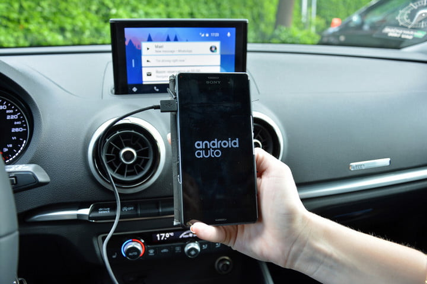

## Compare to Android Auto

Like Apple CarPlay, Android Auto was developed to encourage motorists to keep their eyes on the road and their hands on the steering wheel. It works by Android operation system and contains the Google Maps-powered navigation system, which provides step-by-step directions and automatically finds an alternate route if it detects heavy traffic.[4] In addition, Android Auto works with a variety of third-party apps in Google Play, all of which have been updated to integrate with Auto's specialized interface. These include messaging apps such as Kik, WhatsApp and Skype. There's also music apps including Pandora, Spotify and Google Play Music, natch. And there are audio apps ranging from Audible and NPR One to Overdrive and Stitcher.

In contrast, CarPlay is quite limited with regard to which third-party apps user could use because to add an app that can support IOS OS is more difficult than Andriod. However, App store is safer as compared to Google Play Store.[5] That is true because App Store takes considerable time in reviewing any application and then uploading on the main platform. App Store scrutiny criteria are based on a high-quality standard that is why it takes so much review time. Google Play Store contains some low-quality apps, and its reviews and uploading process is not as complex as compared to App Store.

[Home Page](https://xuniong123-jinchao.github.io/EDCI-337-Project4/)
