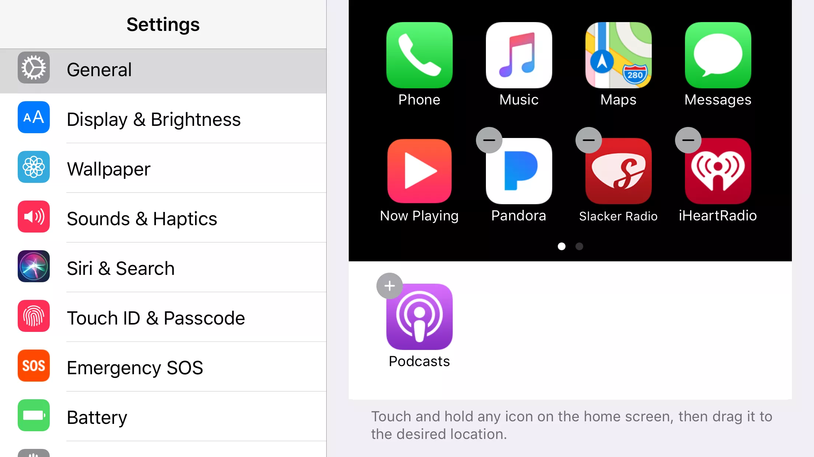

## How to use CarPlay?

### Customize the Carplay Screen

Users can customize the CarPlay screen by moving popular third-party apps to the main screen or even hiding some of the default apps. It's actually quite easy, and you can do it anytime on your iPhone -- even when you don't have CarPlay active.

First, go into your iPhone's Settings app. This is the app with the gears turning.
Next, scroll down and tap General.
In the General settings, choose CarPlay. 
Users should see your car listed on this screen. Tap your car for settings specific to it.[3]
The car settings contain a virtual CarPlay screen. You can move apps around this screen just as you would on an iPhone: tap and hold to 'pick up' an app and keep your finger down on the display while moving it. To drop an app, just lift your finger.
Users can move an app from one page of apps to another page by dragging it to the very left or right edge of the virtual CarPlay's screen and then pausing while the screen flips to the new page.[5]
You can also hide an app by tapping the minus sign on the icon. This moves it to a menu of hidden apps just below the virtual CarPlay screen. You can add it back again by simply tapping it.

Carplay also allow users to add third-party Apps from App Store, such as WhatsApp, Spotify, BBC Sounds, Amazon Music, Google Play Music, iPlayer Radio, CBS Radio, Pandora and Waze. Users can customize the layout of the homescreen by themselves or tap the 'General' to automaticlly generate the screen.

### Voice control using Siri

Carplay have the ability to use Siri hands-free when driving, and can be done in one or two ways. One way is to use the Voice control button on the steering wheel of most, to hold the button until the users can hear the sound of Siri. Those using an aftermarket installation, or those that simply don’t want to hold a button to activate Siri, can use ‘Hey Siri’ on the iPhone to activate the virtual assistant, although results tend to be hit and miss if the environment is loud (car engine, music, etc). It’s also limited to newer iPhones (iPhone 6s and 6s Plus or newer).[4]

Siri voice control can be used for navigation, read/send text and browse for music. Siri can also help users make calls on the go without distracting users from the road. Simply say “Call someone/name” or “return my last call” and Siri will handle the rest. In fact, users can even get it to play back recent voicemails if users ask it to. Meanwhile, these options are also available via the CarPlay dashboard in the Phone app, but it’s not recommended that users interact with the touchscreen while driving.[4]

[Home Page](https://xuniong123-jinchao.github.io/EDCI-337-Project4/)
